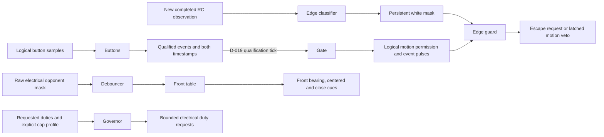
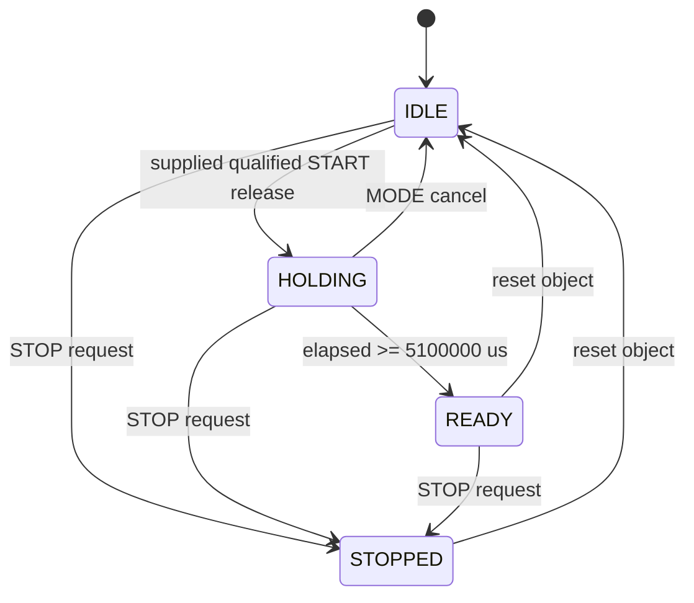

# Core implementation checkpoint

P1 host development is permitted by D-016. P0 hardware acceptance and all human
phase gates remain pending. This describes the implemented standalone modules;
the complete robot scheduler, FSM and actuator path do not yet exist.

| Module | Implemented responsibility | Integration still needed |
|---|---|---|
| `core/types.h` | B0 logical input fields, state/mode/event names, inert output defaults | Recorder outputs, validated HAL input mapping |
| `countdown::Buttons/StopHold` | Logical qualification; rejects boot-held START; D-035 qualified BOTH long hold and reset-only STOP latch | Physical A1 decoding |
| `countdown::Gate` | Full 5.1 s inhibit after a supplied qualified release event, cancel, latched STOP, one GO pulse | Heading reset/calibration/warning/snapshot services, FSM, real MotorGate |
| `countdown::Controller` | D-019 full hold after qualification; D-035 StopHold/external STOP before Gate | Services composition and complete Robot FSM |
| `countdown::Services` | D-024 bounded bias accumulation, rejection/previous-bias retention, latched line warning and latest opponent snapshot | Feed raw gyro/new observations, start/cancel from Controller, apply bias in HAL, complete FSM |
| `edge::Classifier` | Per-corner threshold and consecutive-white confirmation, persistent white mask | Validated fresh QTR acquisition, escape policy, R5 arbitration |
| `edge::Guard` | D-020 persistent escape request, black-plus-finished exit, latched all-white motion veto until reset | Escape directions/scripts/replanning and application of veto at MotorGate |
| `edge::forwardDemand` | D-021 straight/left/right-biased forward requests using 0.80 base and 70% inner-side request | Timed/heading-held segments and selection by the escape planner |
| `opp_fusion::Debouncer` | Per-bit polarity, two-sample assertion, continuous-clear hysteresis | Compose with remaining perception and validated sensor acquisition |
| `opp_fusion::frontView` | Seven front bearing/centering/close rows from B5.2 | Downstream motion/FSM policy |
| `opp_fusion::BearingMemory` | Front/side/rear priority, approved bilateral conflicts, world angle and rising-front recency | Search/re-flank use, full fusion composition |
| `opp_fusion::Contact` | Separate close-pattern qualification, horizontal impact and D-027 centered-ATTACK latch lifetime | FSM contact phase/target-loss braking and physical cue validation |
| `opp_fusion::PhantomFilter` | D-029/D-030 bounded chase history, contact retention, one replaceable world marker and circular front masking | Compose with contact cues before masking, pre-edge state and full fusion/FSM |
| `opp_fusion::StuckFilter` | D-031 continuous valid detection plus observed yaw span; independent reset-only latched bits | Unsuppressed confirmed input, icon/event routing, physical sweep validation |
| `governor::Governor` | D-017 electrical caps after compensation, slew, immediate braking/reversal/cap reductions, one-second battery lag | FSM profile selection and target-loss brake trigger; real MotorGate |
| `motion::Turn/Straight/Arc/Brake` | B7 demands, D-022 bounded heading correction, D-023 fixed timing with duty-only compensation, bounded IMU fallback | Escape/openers/re-flank scripts, explicit governor profile and MotorGate integration |
| `stall::Detector` | D-032 final-duty qualification, timer/deflection routes and persistent per-contact edge history | Governed-duty/contact wiring, event deduplication, physical P4 stall evidence |
| `stall::ReflankLimiter` | B11.3 rolling two-start limit and D-025 bounded suppression timer | Actual re-flank starts and stall-result suppression in Robot, all safety arbitration |
| `openers::Direct` | B12 O2 heading-held 400ms request, snapshot/current target exits and latched zero completion | Global target/edge arbitration and OPENER governor, other openers |
| `openers::Flank` | Shared mirrored SIDESTEP/ARC scripts, D-033 phase-specific aborts, explicit governor profiles and D-034 exit intents | Complete Robot arbitration and WAIT |
| `fsm::DefendTurn` | B10 captured target, front/clear exits and separate B7 700ms/B10 800ms deadlines | Global arbitration, PIVOT governor and MotorGate |
| `logframe` | B15 portable 25-byte frames and 8-byte exact-tick events, explicit invalid/clipped status; D-028 first4096 EventBuffer | HAL-owned buffer instance, frame cadence/storage, event collection, incomplete-evidence marking and idle-only dump |

All inputs are ordinary C++ values. Time arrives from callers as `uint32_t`
microseconds; elapsed intervals use unsigned subtraction. Motion/services
accumulate successive deltas in `uint64_t` to avoid losing a long-duration
deadline at the start-relative wrap. Consecutive calls must remain less than one
whole microsecond-counter wrap apart. Storage is fixed per object. Modules do
no I/O and read no clock. Sensor loops have fixed bounds; encoding is fixed-size.
Host execution does not prove the target's worst-case timing, including math calls.

The current isolated data paths are:

`countdown::Controller` now connects qualification to Gate under D-019. It never
backdates a late qualifying call to the raw release edge. `motion_permitted` is a
logical result, not a hardware write. The application must apply the edge guard's
motion veto to governed outputs and MotorGate: logical permission alone must not
bypass all-white inhibition. Composed host tests check this path without claiming
that the full app or real MotorGate exists. Only the future HAL MotorGate may
write EN/PWM; BOOT, IDLE, COUNTDOWN and STOPPED must inhibit motion.

The edge guard handles the default zero push-through window. A positive configured
window fails compilation until its bounded exception is implemented and tested.
An all-white fault persists across black readings, script completion and revoked
permission; only explicit guard reset clears it. Before GO, line readings do not
start escape or latch a new fault. Normal escape requires both all-black readings
and a finished script to clear. Scripts/replanning and freshness remain separate.

This diagram is the implemented standalone Gate, **not the unfinished Robot FSM**:

Reset is a software lifecycle operation. D-035 approves reset-only logical STOP
recovery; this does not grant permission to reset hardware. GO is emitted once
on entry to READY; permission stays latched until
STOP or reset. No commanded motor duties are produced by these services.

The intended complete path remains the original architecture: MCU scheduler reads
HAL -> builds Inputs -> steps Robot -> governor -> MotorGate. Linux builds,
flashes and receives idle log dumps. As PLAN section 7 explains, control belongs
on the MCU so Linux boot and scheduling cannot delay edge response; target timing,
boot behavior and log independence still need their own evidence. D-018 approves
gated-state services before motor inhibition; the complete scheduler/FSM is still
pending. D-017 approves final electrical caps; the governor implements those for
the specified profiles. D-020 resolves persistent/all-white inhibition. QTR
acquisition, timed escape motion/replanning and ALL_IN arbitration remain pending.
Recorder overflow policy is approved as D-028; actual recording/dump integration
remains pending. Protected decisions are in `state/analysis/spec_conflicts.md`.

The governor's battery filter is a first-order lag with the existing B6 one-second
time constant, using backward Euler: `alpha = dt / (tau + dt)`. Its first sample
initializes voltage and has zero acceleration budget. Signed braking and reductions
to smaller safety caps are immediate; reversal emits zero before opposite torque.
Nonfinite inputs yield a zero result with `valid=false`, leaving the application
fault decision to its future controller. Target-loss braking still requires the
FSM to assert `brake`; dropping centered/contact flags alone selects the approach
cap and is not an implementation of the separate B6 target-loss transition.

D-021 now supplies the forward escape base and cap: EDGE_BACK_DUTY (0.80 default).
The pure demand builder produces `(0.80, 0.80)`, `(0.56, 0.80)` for left bias,
or its right mirror. The caller must pass these through the EDGE_FORWARD governor
profile and obey the edge guard's veto. The 70% value specifies requested duties;
compensation, individual caps and acceleration slew can alter the final ratio.
For example, at 9 V after settling, a left-biased request becomes approximately
`(0.69067, 0.80)`. This is arithmetic, not a measured turn trajectory. No timed
segment, heading-hold controller or hardware path is supplied by this helper.

Motion now supplies those generic primitives separately; it does not yet select
or sequence escape/opener/re-flank segments. A turn uses shortest signed heading
error, a strict 5-degree completion tolerance and the original 700ms timeout.
On IMU loss it times the last known remaining angle once, without extending that
deadline on recovery. Straight correction preserves wheel direction, including
reverse, and arcs use accumulated yaw. Every terminal command requests zero;
only the eventual caller/governor/MotorGate path can grant and apply motion.

Countdown Services uses the D-024 half-open [1500,4500)ms window and reports its
result once. It accepts raw gyro values before bias subtraction. Missing samples
are never manufactured; any invalid in-window observation rejects calibration,
and duplicate timestamps add no observation. The application must start this
object on the qualified release and cancel it on IDLE/STOPPED transitions. The
independent host harness checks that composition; Controller alone still only
owns Buttons, StopHold and Gate. Line warning does not block GO. Physical sample freshness,
HAL bias application and the heading reset at GO still need integration.

Recorder encoding retains multi-revolution heading in signed 32-bit centidegrees
and event time in uint32 microseconds. Encoding is separate from collection.
EventBuffer now implements D-028 with fixed 32768-byte payload storage: it retains
the first4096 insertion-ordered encoded events, rejects later entries with a
latched overflow flag and saturating uint32 count, and resets logical contents in
constant work. The later HAL recorder owns its instance and lifecycle. It must
check encoding status before appending, continue frames after event overflow and
mark an overflowed dump as incomplete evidence. No frame recorder or CSV/dump
transport exists yet; a non-overflowed container alone does not prove completeness.

The new filter stages remain independently testable components. Stuck qualification
uses confirmed bits before phantom suppression; invalid IMU restarts only pending
candidates. It records observed continuous-yaw span, not modulo heading or total
back-and-forth travel. Phantom detection uses the state before edge arbitration,
remembering any current contact cue during that chase; a consumed edge cannot be
replayed to extend a marker. Valid close/side/rear observations override masking.
Complete fusion still needs to wire those inputs and preserve actual sample age.

Stall detection stores contact heading/edge history separately from the continuous
qualification timer. Suppression changes its final stalled level only. The limiter
counts starts even if an escape later interrupts them; denied requests never
extend an active ALL_IN period. Neither component writes duties or changes Robot
state. DIRECT returns target/SEARCH exit intents with zero terminal demand; the
future FSM owns actual transitions, immediate target-loss braking and edge priority.

Student explanation of what exists today: "We pass timestamped values into small
C++ functions, so the laptop tests the same decisions without a robot. The start
timer keeps the full hold, while calibration and warning services run separately.
Sensor filters reject flicker; bearing memory prioritizes the front and preserves
uncertainty when sensors disagree. Contact can authorize full duty only while a
target remains centered in ATTACK. Motion functions request bounded turns and
straight segments, then the governor limits their electrical duty. The recorder
codec preserves exact event ticks. These pieces cannot drive motors by themselves:
we still need complete arbitration and scripts, hardware integration, physical
motor-gate checks and timing measurements."
