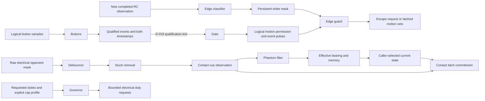
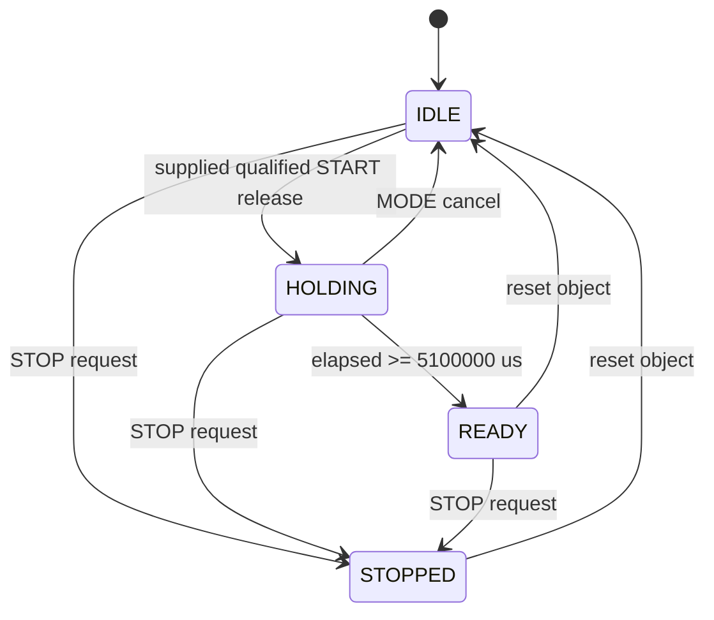

# Core implementation checkpoint

P1 host development is permitted by D-016. P0 hardware acceptance and all human
phase gates remain pending. This describes the implemented standalone modules;
the complete robot scheduler, FSM and actuator path do not yet exist.

| Module | Implemented responsibility | Integration still needed |
|---|---|---|
| `core/types.h` | B0 logical input fields, state/mode/event names, inert output defaults | Recorder outputs, validated HAL input mapping |
| `countdown::Buttons/StopHold` | Logical qualification; rejects boot-held START; D-035 qualified BOTH long hold and reset-only STOP latch | Physical A1 decoding |
| `countdown::Gate` | Full 5.1 s inhibit after a supplied qualified release event, cancel, latched STOP, one GO pulse | Heading reset/calibration/warning/snapshot services, FSM, real MotorGate |
| `countdown::Controller` | D-019 full hold after qualification; D-035 StopHold/external STOP before Gate; D-057 START-only routing and qualified-event snapshot | Logical menu and complete Robot FSM |
| `countdown::Services` | D-024 bounded bias accumulation, rejection/previous-bias retention, latched line warning and latest opponent snapshot | Feed raw gyro/new observations, start/cancel from Controller, apply bias in HAL, complete FSM |
| `countdown::Lifecycle` | Production Controller-first Services start/cancel/GO composition, explicit failed-start diagnostics and completed evidence retention | HAL bias/heading application, menu/Robot wiring and real MotorGate |
| `countdown::Menu` | D-058 logical MODE qualification, mode/service cycling and typed service intent, with entry-state/fault precedence and duplicate suppression | Robot running-mode capture, real service consumers and HAL display |
| `edge::Classifier` | Per-corner threshold and consecutive-white confirmation, persistent white mask | Validated fresh QTR acquisition, escape policy, R5 arbitration |
| `edge::Guard` | D-020 persistent escape request, black-plus-finished exit, latched all-white motion veto until reset | Escape directions/scripts/replanning and application of veto at MotorGate |
| `edge::forwardDemand` | D-021 straight/left/right-biased forward requests using 0.80 base and 70% inner-side request | Timed/heading-held segments and selection by the escape planner |
| `edge::RowExecutor` | B4.2 scripts plus explicit-side head-on and pushed-out entry, bounded transitions, relative heading capture/fallback and governor profiles | Production Robot arbitration and fresh HAL observations |
| `edge::Escape` | D-047..D-050/D-054 full selection, persistent-white replanning, reset-only recovery faults and fresh inward evidence at actual exit | Robot priority, previous applied-duty feedback, validated QTR freshness and MotorGate inhibition |
| `opp_fusion::Debouncer` | Per-bit polarity, two-sample assertion, continuous-clear hysteresis | Validated sensor acquisition |
| `opp_fusion::frontView` | Seven front bearing/centering/close rows from B5.2 | Downstream motion/FSM policy |
| `opp_fusion::BearingMemory` | Front/side/rear priority, approved bilateral conflicts, world angle and rising-front recency | Search/re-flank use and memory-age ownership |
| `opp_fusion::Contact` | Separate cue observation, read-only candidate preview and D-027 centered-ATTACK latch commitment; legacy step composes observation/commit | FSM contact phase/target-loss braking and physical cue validation |
| `opp_fusion::PhantomFilter` | D-029/D-030 bounded chase history, contact retention, one replaceable world marker and circular front masking | Robot supplies pre-edge state; icon/event routing and physical validation |
| `opp_fusion::StuckFilter` | D-031 continuous valid detection plus observed yaw span; independent reset-only latched bits | Icon/event routing and physical sweep validation |
| `opp_fusion::Fusion` | Ordered fresh-observation pipeline, effective bearing/memory, D-056 read-only contact preview and one final-state contact commit | Actual Robot/stall state selection, HAL sampling and governor/event dispatch |
| `governor::Governor` | D-017 electrical caps after compensation, slew, immediate braking/reversal/cap reductions, one-second battery lag | FSM profile selection and target-loss brake trigger; real MotorGate |
| `motion::Turn/Straight/Arc/Brake` | B7 demands, D-022 bounded heading correction, D-023 fixed timing with duty-only compensation, bounded IMU fallback | Escape/openers/re-flank scripts, explicit governor profile and MotorGate integration |
| `stall::Detector` | D-032 final-duty qualification, timer/deflection routes and persistent per-contact edge history | Governed-duty/contact wiring, event deduplication, physical P4 stall evidence |
| `stall::ReflankLimiter` | B11.3 rolling two-start limit and D-025 bounded suppression timer | Actual re-flank starts and stall-result suppression in Robot, all safety arbitration |
| `openers::Direct` | B12 O2 heading-held 400ms request, snapshot/current target exits and latched zero completion | Global target/edge arbitration and OPENER governor, other openers |
| `openers::Flank` | Shared mirrored SIDESTEP/ARC scripts, D-033 phase-specific aborts, relative turns, explicit governor profiles and D-034 exit intents | Complete Robot arbitration |
| `openers::Wait` | D-055 stationary hold and ordered approach cue, then complete SIDESTEP_R with existing exits and bounded deadlines | Complete Robot arbitration and physical evasive geometry |
| `fsm::DefendTurn` | B10 captured target, front/clear exits and separate B7 700ms/B10 800ms deadlines | Global arbitration, PIVOT governor and MotorGate |
| `fsm::frontDemand` | D-036 TRACK/ATTACK front-row requests, explicit profiles and invalid zero results | Centered qualification/state selection, current D-027 contact, immediate target-loss brake dispatch |
| `fsm::FrontQualification` | B9 count of consecutive new centered observations, saturating eligibility and explicit reset | Normal-entry observation selection, preemption/reset wiring and complete state/contact/governor arbitration |
| `fsm::NormalPerception` | D-045 current entry observation and D-046 immediate front-loss brake followed by current-perception routing | Script/edge/stall preemption, actual state lifecycle and one final governor dispatch |
| `fsm::SearchSide/Search` | D-041 selected-bearing side retention; B8 memory turn, directed full scan, advance and alternating scans with D-042 latched fallback | Truthful history ages, actual escape/hint sources, current perception, global edge/STOP arbitration and governor/MotorGate |
| `fsm::chooseSwing/Reflank` | D-037/D-043 side priority and B11 BACK/SWING/TURN_IN executor with captured turns, D-040 exits and exact entry notifications | Actual history/limiter admission, D-038/D-045 reacquisition, D-027 contact and global safety arbitration |
| `motion::TimedArc` | D-037 mirrored duration-only forward arc, no invented heading cutoff | Re-flank sequencing, REFLANK_TURN governor and global safety arbitration |
| `logframe` | B15 portable 25-byte frames and 8-byte exact-tick events, explicit invalid/clipped status; D-028 first4096 EventBuffer | HAL-owned buffer instance, frame cadence/storage, event collection, incomplete-evidence marking and idle-only dump |
| `logframe::TickStatistics` | B14 counts of supplied durations, strict overrun/rate thresholds, full maximum and explicit saturation | Actual scheduler measurements, match membership, event/recorder dispatch and target WCET evidence |

All inputs are ordinary C++ values. Time arrives from callers as `uint32_t`
microseconds; elapsed intervals use unsigned subtraction. Motion/services
accumulate successive deltas in `uint64_t` to avoid losing a long-duration
deadline at the start-relative wrap. Consecutive calls must remain less than one
whole microsecond-counter wrap apart. Storage is fixed per object. Modules do
no I/O and read no clock. Sensor loops have fixed bounds; encoding is fixed-size.
Host execution does not prove the target's worst-case timing, including math calls.

The current component data paths are:

`countdown::Controller` now connects qualification to Gate under D-019. It never
backdates a late qualifying call to the raw release edge. `motion_permitted` is a
logical result, not a hardware write. The application must apply the edge guard's
motion veto to governed outputs and MotorGate: logical permission alone must not
bypass all-white inhibition. Composed host tests check this path without claiming
that the full app or real MotorGate exists. Only the future HAL MotorGate may
write EN/PWM; BOOT, IDLE, COUNTDOWN and STOPPED must inhibit motion.

The edge guard handles the default zero push-through window. A positive configured
window fails compilation until its bounded exception is implemented and tested.
An all-white fault persists across black readings, script completion and revoked
permission; only explicit guard reset clears it. Before GO, line readings do not
start escape or latch a new fault. Normal escape requires both all-black readings
and a finished script to clear. Scripts/replanning and freshness remain separate.

RowExecutor executes the specified B4.2 rows. Front/diagonal rows
brake one tick, reverse120ms and turn120 degrees away; single rear rows advance
with70% inner-wheel bias; both rear advance straight; same-side rows pivot45
degrees then advance200ms. Segment entry captures the current/last healthy heading
and starts its own deadline at the observation time. B7 fallback and governor
profiles apply. Unsupported rows return an explicit zero/unsupported result;
that is API coverage, not an approved escape recovery policy. DONE cannot clear
the guard while white persists. Explicit head-on and pushed-out entries capture
their selected directions without retargeting. Escape composes these rows with
the approved shared-side history, strict positive prior applied duties and
fault-first pattern priority. It admits at most one replacement per observation,
allows three replacements, and inhibits on a fourth request. Permission loss
during escape also latches inhibition until reset. Only actual black-plus-DONE
exit with current healthy finite yaw publishes inward evidence. The caller must
supply fresh confirmed observations and apply every inhibition at MotorGate.

This diagram is the implemented standalone Gate, **not the unfinished Robot FSM**:

Reset is a software lifecycle operation. D-035 approves reset-only logical STOP
recovery; this does not grant permission to reset hardware. GO is emitted once
on entry to READY; permission stays latched until
STOP or reset. No commanded motor duties are produced by these services.

The intended complete path remains the original architecture: MCU scheduler reads
HAL -> builds Inputs -> steps Robot -> governor -> MotorGate. Linux builds,
flashes and receives idle log dumps. As PLAN section 7 explains, control belongs
on the MCU so Linux boot and scheduling cannot delay edge response; target timing,
boot behavior and log independence still need their own evidence. D-018 approves
gated-state services before motor inhibition; the complete scheduler/FSM is still
pending. D-017 approves final electrical caps; the governor implements those for
the specified profiles. D-020 resolves persistent/all-white inhibition. QTR
acquisition, global escape priority and ALL_IN arbitration remain pending.
Recorder overflow policy is approved as D-028; actual recording/dump integration
remains pending. Protected decisions are in `state/analysis/spec_conflicts.md`.

The governor's battery filter is a first-order lag with the existing B6 one-second
time constant, using backward Euler: `alpha = dt / (tau + dt)`. Its first sample
initializes voltage and has zero acceleration budget. Signed braking and reductions
to smaller safety caps are immediate; reversal emits zero before opposite torque.
Nonfinite inputs yield a zero result with `valid=false`, leaving the application
fault decision to its future controller. Target-loss braking still requires the
FSM to assert `brake`; dropping centered/contact flags alone selects the approach
cap and is not an implementation of the separate B6 target-loss transition.

D-021 now supplies the forward escape base and cap: EDGE_BACK_DUTY (0.80 default).
The pure demand builder produces `(0.80, 0.80)`, `(0.56, 0.80)` for left bias,
or its right mirror. The caller must pass these through the EDGE_FORWARD governor
profile and obey the edge guard's veto. The 70% value specifies requested duties;
compensation, individual caps and acceleration slew can alter the final ratio.
For example, at 9 V after settling, a left-biased request becomes approximately
`(0.69067, 0.80)`. This is arithmetic, not a measured turn trajectory. The helper
supplies no timing or hardware path; RowExecutor now sequences specified rows.

Motion supplies generic primitives; script modules compose them without granting
motor permission. A turn uses shortest signed heading
error, a strict 5-degree completion tolerance and the original 700ms timeout.
On IMU loss it times the last known remaining angle once, without extending that
deadline on recovery. Straight correction preserves wheel direction, including
reverse, and arcs use accumulated yaw. Every terminal command requests zero;
only the eventual caller/governor/MotorGate path can grant and apply motion.
Relative turns keep captured origin and measured-yaw math in double internally,
preserving strict tolerance and exact antipodal direction without inventing
observations. A healthy nonfinite yaw invalidates even latched fallback; the
original turn deadline still wins at its exact tick.

Countdown Services uses the D-024 half-open [1500,4500)ms window and reports its
result once. It accepts raw gyro values before bias subtraction. Missing samples
are never manufactured; any invalid in-window observation rejects calibration,
and duplicate timestamps add no observation. The application must start this
object on the qualified release and cancel it on IDLE/STOPPED transitions. The
independent host harness checks that composition; Controller alone still only
owns Buttons, StopHold and Gate. Line warning does not block GO. Physical sample freshness,
HAL bias application and the heading reset at GO still need integration.
Lifecycle now owns that service start/cancel ordering in production code while
Controller remains the only GO authority. It retains completed service evidence
on a later STOP and reports failed starts explicitly. Services finishing alone
never grants permission, including on sparse wrapped input streams.
D-057 adds a START-only routing selector, default true. False consumes a new
qualified release without passing it to Gate, while debounce, STOP, MODE and
existing timers still advance. It cannot cancel an already accepted countdown or
revoke READY. The latest qualified event snapshot is available without resampling;
the future menu must check final IDLE/STOP/fault policy before a service request.
A suppressed idle START cannot start calibration or reset heading. Existing
attempts retain their original lifetime. No actual menu/service action runs here.

Menu now supplies the logical B13 selection path. A fresh qualified NONE arms
exclusive MODE; its qualified press anchors duration, while first NONE freezes
the release duration. Under600ms cycles an item after release qualification;
600–999ms does nothing; continuous1000ms toggles services once. Entry-state IDLE
and final non-inhibition are required, so canceling a countdown cannot reuse
that MODE gesture to change selection. Controller owns START/STOP sampling;
Menu consumes its qualified START snapshot to emit a service intent with no
Gate mutation. DRIVE_TEST remains unavailable in P1, and other intents require
real consumers. Menu never grants permission, executes calibration/dumps or
supplies a fabricated success for a missing consumer.

Recorder encoding retains multi-revolution heading in signed 32-bit centidegrees
and event time in uint32 microseconds. Encoding is separate from collection.
EventBuffer now implements D-028 with fixed 32768-byte payload storage: it retains
the first4096 insertion-ordered encoded events, rejects later entries with a
latched overflow flag and saturating uint32 count, and resets logical contents in
constant work. The later HAL recorder owns its instance and lifecycle. It must
check encoding status before appending, continue frames after event overflow and
mark an overflowed dump as incomplete evidence. No frame recorder or CSV/dump
transport exists yet; a non-overflowed container alone does not prove completeness.

The filter stages remain independently testable components. Stuck qualification
uses confirmed bits before phantom suppression; invalid IMU restarts only pending
candidates. It records observed continuous-yaw span, not modulo heading or total
back-and-forth travel. Phantom detection uses the state before edge arbitration,
remembering any current contact cue during that chase; a consumed edge cannot be
replayed to extend a marker. Valid close/side/rear observations override masking.
Fusion now wires this order: debounce, stuck removal, contact cue observation,
phantom masking with the prior state, then effective bearing/memory. It never
uses unavailable IMU yaw as fresh world-bearing evidence. The caller then selects
the final state and commits contact once, so ATTACK entry/exit uses this tick's cue
without counting the same close-sensor observation twice. Repeated timestamps
return cached data marked nonfresh with event pulses cleared. Missing or repeated
commit returns invalid zero contact and clears the latch; replacing an uncommitted
observation also clears the old latch. These protocol checks do not validate
physical acquisition freshness. The full Robot must supply accurate prior/current
states and apply the result to the governor; the pipeline never grants motion.
D-056's const preview can predict centered ATTACK contact for a stall decision
without advancing the latch or consuming the observation. Only the final commit
may publish CONTACT or authorize the governor; repeated previews are not events.
Stall and pushed-out checks use the preceding actual applied final duties, with
zero feedback if the hardware inhibits. The future Robot must call Governor once.

Stall detection stores contact heading/edge history separately from the continuous
qualification timer. Suppression changes its final stalled level only. The limiter
counts starts even if an escape later interrupts them; denied requests never
extend an active ALL_IN period. Neither component writes duties or changes Robot
state. DIRECT returns target/SEARCH exit intents with zero terminal demand; the
future FSM owns actual transitions, immediate target-loss braking and edge priority.
Reflank captures BACK, its swing pivot, the opposite-direction timed arc and
TURN_IN independently. Inner-side triggers preempt either swing segment. Both
same-tick public phase entries remain visible for exact event recording. The
caller must record actual swing history, admit starts through the limiter and
reset qualification/contact before current-perception reacquisition.

Tick statistics consume durations supplied by the caller; they read no clock.
Overruns are strictly above TICK_US, and the current retained-count ratio is
compared exactly against B14's1%. Counts stop at uint64 capacity and mark the
statistics incomplete; the full uint32 maximum continues updating. Frame packing
reports its own narrower-field clamping. Neither a zero overrun count nor a
passing arithmetic test proves that the robot meets R4's under800us requirement.

SEARCH captures its initial memory turn and first scan direction, then alternates
full scans with short heading-held advances. Its full sweep uses continuous yaw,
not a shortest-angle turn or the short-turn timeout. First IMU loss latches the
remaining timed sweep once; recovery does not restart it. Inward history ages to
zero without revival after timestamp wrap. Current targets return zero demand
and a perception intent; the eventual Robot owns the state change and permission.

WAIT brakes during HOLD. Continuous confirmed FC followed on a later observation
by a newly asserted front flank within300ms starts complete SIDESTEP_R, including
the initial pivot, under D-055. A continuously held FC cannot restart an expired
window. Side/rear aborts outrank the cue; a valid cue outranks the WAIT deadline.
Flank then supplies all motion, front/side exits and fallback. This explicit
replacement of the original no-pivot text needs later physical evasion validation.

Student explanation of what exists today: "We pass timestamped values into small
C++ functions, so the laptop tests the same decisions without a robot. The start
timer keeps the full hold, while calibration and warning services run separately.
Sensor filters reject flicker; bearing memory prioritizes the front and preserves
uncertainty when sensors disagree. Contact can authorize full duty only while a
target remains centered in ATTACK. Motion functions request bounded turns and
straight segments, then the governor limits their electrical duty. The recorder
codec preserves exact event ticks. These pieces cannot drive motors by themselves:
we still need complete arbitration and scripts, hardware integration, physical
motor-gate checks and timing measurements."
