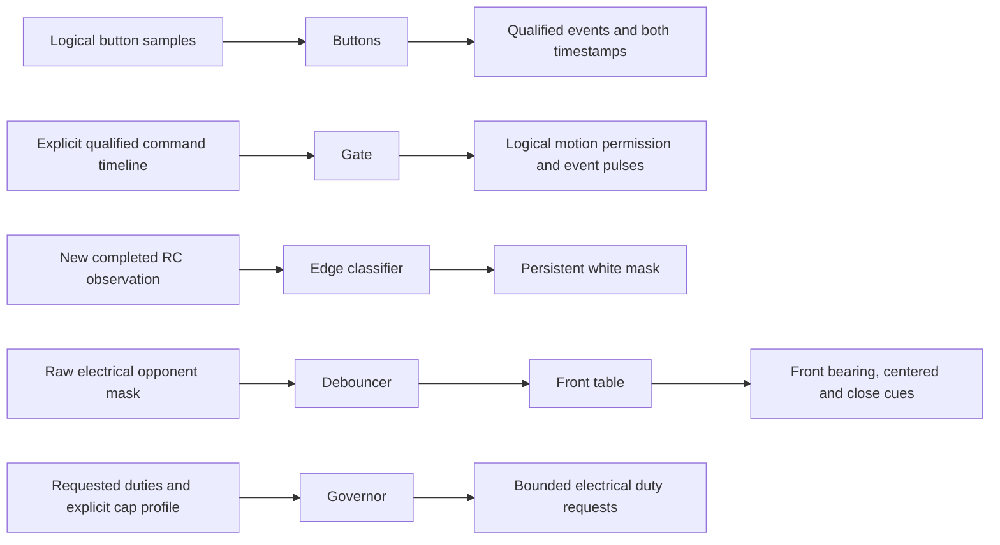
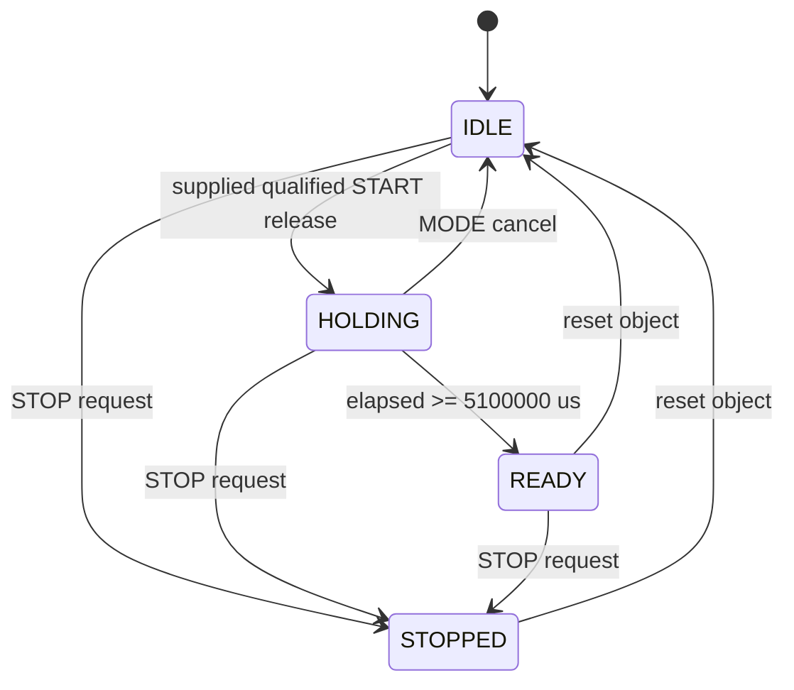

# Core implementation checkpoint

P1 host development is permitted by D-016. P0 hardware acceptance and all human
phase gates remain pending. This describes the implemented standalone modules;
the complete robot scheduler, FSM and actuator path do not yet exist.

| Module | Implemented responsibility | Integration still needed |
|---|---|---|
| `core/types.h` | B0 logical input fields, state/mode/event names, inert output defaults | Recorder outputs, validated HAL input mapping |
| `countdown::Buttons` | Stable logical level qualification; rejects boot-held START; reports release edge and qualification timestamps | A1 decoding, both-held STOP, approved countdown timestamp anchor |
| `countdown::Gate` | Full 5.1 s inhibit after a supplied qualified release event, cancel, latched STOP, one GO pulse | Heading reset/calibration/warning/snapshot services, FSM, real MotorGate |
| `edge::Classifier` | Per-corner threshold and consecutive-white confirmation, persistent white mask | Validated fresh QTR acquisition, escape policy, R5 arbitration |
| `opp_fusion::Debouncer` | Per-bit polarity, two-sample assertion, continuous-clear hysteresis | Bearing memory, side/rear conflict policy, contact, phantom/stuck logic |
| `opp_fusion::frontView` | Seven front bearing/centering/close rows from B5.2 | Overall target selection and downstream motion policy |
| `governor::Governor` | D-017 electrical caps after compensation, slew, immediate braking/reversal/cap reductions, one-second battery lag | FSM profile selection and target-loss brake trigger; real MotorGate |

All inputs are ordinary C++ values. Time arrives from callers as `uint32_t`
microseconds; elapsed intervals use unsigned subtraction. Storage is fixed per
object. The modules do no I/O and read no clock. Their loops are bounded by four
or seven sensors. Host execution does not prove the target's worst-case timing.

The current isolated data paths are:

There is deliberately no connection from button timestamps to Gate until SC-J is
decided, or from Gate permission to motors. `motion_permitted` is a core result;
only the future HAL MotorGate may write EN/PWM. The real controller must still
inhibit motion in BOOT, IDLE, COUNTDOWN and STOPPED.

This diagram is the implemented standalone Gate, **not the unfinished Robot FSM**:

Reset is a software lifecycle operation, not a new physical STOP-recovery
interaction. GO is emitted once on entry to READY; permission stays latched until
STOP or reset. No commanded motor duties are produced by these services.

The intended complete path remains the original architecture: MCU scheduler reads
HAL -> builds Inputs -> steps Robot -> governor -> MotorGate. Linux builds,
flashes and receives idle log dumps. As PLAN section 7 explains, control belongs
on the MCU so Linux boot and scheduling cannot delay edge response; target timing,
boot behavior and log independence still need their own evidence. D-018 approves
gated-state services before motor inhibition; the complete scheduler/FSM is still
pending. D-017 approves final electrical caps; the governor implements those for
the specified profiles. QTR acquisition, edge escape including its forward cap,
ALL_IN arbitration and recorder policy remain in `state/analysis/spec_conflicts.md`.

The governor's battery filter is a first-order lag with the existing B6 one-second
time constant, using backward Euler: `alpha = dt / (tau + dt)`. Its first sample
initializes voltage and has zero acceleration budget. Signed braking and reductions
to smaller safety caps are immediate; reversal emits zero before opposite torque.
Nonfinite inputs yield a zero result with `valid=false`, leaving the application
fault decision to its future controller. Target-loss braking still requires the
FSM to assert `brake`; dropping centered/contact flags alone selects the approach
cap and is not an implementation of the separate B6 target-loss transition.

Student explanation of what exists today: "We pass timestamped values into small
C++ functions, so the laptop can test the same decisions without a robot. The
start timer cannot grant permission until the complete hold has elapsed. Separate
filters reject sensor flicker and classify the line corners; a table converts
front detections into a bearing. These pieces cannot drive motors by themselves.
We still have to connect the approved control rules, verify the hardware motor
gate, and measure the complete loop on the robot."
