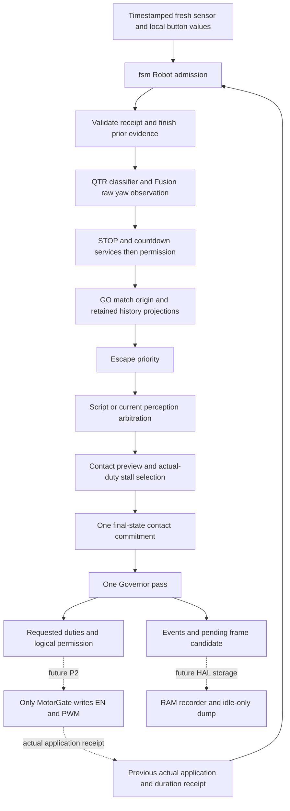
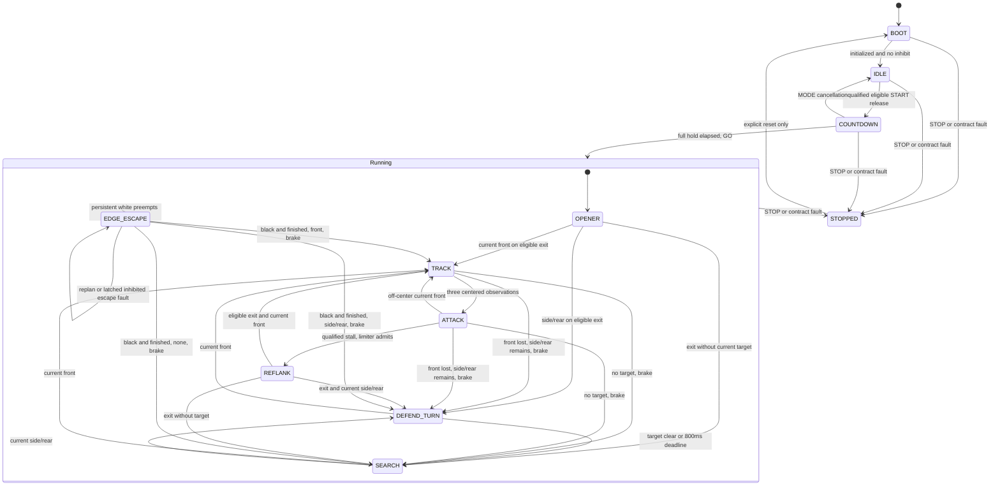

# Production core architecture

P1 host development is authorized by D-016 while P0 hardware acceptance remains
pending. D-060/D-061 supply the actual `fsm::Robot` transaction. The895-case
normal and sanitizer suites pass, and the inert app compiles on the UNO Q;
validation receipts are in `state/analysis/P1_robot_validation.md`.
No human phase gate, physical MotorGate check or complete-loop timing is implied.

## Module ownership

| Module | Responsibility | Boundary still outside the core |
|---|---|---|
| `types.h`, `config.h` | Fixed value types and centralized B16 defaults | Verified pins and physical tuning |
| `countdown` | Button qualification, full 5.1 s hold, reset-only STOP, countdown calibration/warnings/snapshot, logical mode/service menu | Physical A1 decoding, display, applying accepted bias and service consumers |
| `edge` | Raw RC classification, persistent-white arbitration, escape rows/replans, inhibited reset-only recovery faults | Fresh acquisition satisfying SC-B, motor braking and ring geometry |
| `opp_fusion` | Polarity/debounce, stuck and phantom filtering, bearing memory, contact observation/preview and one final-state commitment | Sensor range/polarity, IMU continuity and physical contact evidence |
| `governor` | Voltage compensation followed by final electrical caps and slew; immediate safety braking/cap reductions | Actual MotorGate application, quantization toward zero and verified PWM APIs |
| `motion` | Bounded turns, straight segments, arcs and brakes; timed fallback on missing IMU | Measured angle/timing performance |
| `openers` | DIRECT, mirrored SIDESTEP/ARC and WAIT scripts returning demand or current-perception exit intents | Physical opener clearance and match validation |
| `stall` | Actual-duty/contact qualification, timer/deflection detection, bounded re-flank admission and ALL_IN suppression | Physical stall measurements |
| `fsm` helpers | Heading origin, SEARCH/DEFEND/re-flank executors, side history and centered front qualification | Valid input and actual-application providers |
| `fsm::Robot` (`fsm_robot.cpp`) | Owns components; admits one observation, applies gate/edge/script/current-target priority, commits contact once and governs once; owns bounded histories, warnings and evidence scheduling | Real scheduler, HAL and recorder storage/transport |
| `logframe` | Explicit portable frame/event encoding, metadata validation, bounded 21-event batch, first4096 event retention, supplied-duration statistics | RAM frame ring, idle-only dump, physical timing source and incomplete-dump presentation |

Core code is pure C++17: no Arduino headers, clock reads, I/O, allocation or
Linux dependency. Fixed sensor/metadata loops and bounded script transitions
keep work finite. Time arrives from the caller as `uint32_t t_us`; consecutive
observations must be less than one complete micros wrap apart. Histories use
bounded ages or accumulated deltas, so an old timestamp cannot revive evidence.
Host runtime and sanitizer checks do not prove the under800us target tick bound.

## One production observation

1. Admit a distinct timestamp and unique token. An immediate duplicate returns
   cached persistent values with `fresh=false` and all action/event/frame pulses
   cleared. Reset clears runtime but preserves token uniqueness.
2. Validate the previous token's actual output-stage receipt. Duty must be finite,
   obey prior permission, and have the requested sign and no greater magnitude.
   Missing/invalid application latches STOPPED. Validate duration independently;
   missing/malformed duration marks incomplete timing, without changing motion.
   Finalize any prior frame from actual application and publish prior receipt
   events before current decisions.
3. Age histories; validate required fresh QTR/opponent/battery context. On a valid
   observation, classify raw QTR once and run Fusion once in continuous raw yaw.
   Stale data cancels services before sampling and is never counted as fresh.
4. Run real button/STOP/countdown services before the motor gate. Accepted START
   captures the selected running mode and recording epoch. GO establishes D-059's
   logical match origin before moving references. Raw Fusion histories stay raw.
5. With permission, run Escape first, then an ongoing re-flank/opener, then normal
   current perception. Script exit can make only one normal selection and new
   executor entry that tick. Loss/escape-exit ticks brake; deferred motion starts
   no earlier than the next observation.
6. Preview contact for stall selection with preceding actual duties. Admit at most
   one re-flank, update swing history only on actual SWING entry, and validate the
   selected demand. Commit contact once against the final state. Governor runs
   once; full duty still requires centered ATTACK contact, including during ALL_IN.
7. Publish deduplicated faults/state/edge/contact/script events and a bounded frame
   candidate. Return requested duties and permission; these are not proof that
   MotorGate applied them. The next matching receipt supplies that evidence.

The required receipt is an application contract, not measured wheel motion.
Timing receipts use the whole tick start/completion difference, not successive
loop intervals. Timing membership starts at GO and includes the final stopping
tick. The actual scheduler must measure acquisition, decision, application and
recording, including faults/timeouts; fabricated or desktop durations do not
qualify the robot.

## State transitions and precedence

This graph describes D-060 integration and the explicit D-034/D-038/D-045/D-046
amendments. The older B1 diagram's direct script-to-ATTACK arrows do not bypass
current centering: exits pass through TRACK and require three observations.

The composite boundary represents global precedence, not a second implementation
of the state machine. White already present at GO selects Escape before opener
motion. All-white, three-white and exhausted replacement policies inhibit and
retain EDGE_ESCAPE until reset, unless explicit STOP/contract failure selects
STOPPED. Reset from any state returns to the normal BOOT/START sequence. ALL_IN
is bounded stall suppression within ATTACK, never an edge/contact override.
DEFEND_TURN's B7 turn completion alone holds terminal zero demand; current front,
target clear or its separate800ms deadline supplies the actual exit condition.
D-061 also handles first side/rear conflict without any usable prior bearing:
Robot waits at zero, with800ms anchored at that first ambiguous observation.
Later valid capture starts the real turn without extending that deadline. This
valid unknown information does not itself become a reset-only contract fault.
DRIVE_TEST remains unavailable in P1. Push-through, optional evasion and IMU stall
refinement remain disabled; enabling unsupported options is not silently accepted.

## Evidence and device separation

Frames start at accepted START and use a25Hz phase-anchored schedule (D-072's
specified B15 low-memory fallback from the original50Hz), at most one
candidate per observation with explicit skipped slots. A frame waits for its
matched actual application; CLAMPED/INVALID status is retained and marks evidence
incomplete. No application means no completed frame. Cancellation or an inhibited
stop produces one final candidate and ends collection. Before GO heading is raw;
after GO it is match-relative. The gyro rate is explicitly raw/pre-bias. Missing
IMU never turns a nominal heading into a healthy measurement.

The fixed21-entry event batch includes up to two prior receipt extensions and19
current decision events. Invalid metadata and full-batch rejections have separate
saturating counters. The separately owned4096-event buffer preserves the first
entries, reports overflow/rejections and must not stop frame recording. No event
or timing overflow can authorize motion. The offline D-069/D-070 RAM owner
preserves last-match data across Robot reset. D-073 adds stateless CSV formatting
of exact encoded integers, raw bytes, statuses and every loss counter. Its metadata
snapshot copies no payload arrays. Callers must prevent concurrent mutation;
this formatter grants no live dump permission. Runtime integration and transport
remain pending: SEALED is not current IDLE, and absence of known loss is not proof
that recording finished or a dump has no gaps.

Per PLAN section7, the STM32U585 owns sensing/decisions/actuation without waiting
for Linux. Linux builds/flashes and later stores/plots logs. No radio, Bridge or
serial motion-command path exists. A later MATCH dump is permitted only in IDLE
and must be bounded and startup-ready; it cannot enter the control dependency.

`src/app/app.ino` currently supplies an inert compile/link entry for P1 task1.5:
one default BOOT Robot call in setup, a volatile RAM check and an empty loop. A
compile-time guard rejects motor-enabled builds. It is not the P2 scheduler or
HAL. Tooling rejects app uploads. Actual inert app target compilation and host
results must be reported separately from uploads and physical tests.

## Sixty-second explanation

"The microcontroller gets one fresh sensor snapshot and runs the same C++ Robot
that we test on the laptop. START must be released and debounced before the full
five-second hold begins. During that hold, motors remain disabled while we
calibrate and watch the sensors. After GO, the edge sensors have priority over
all fighting strategies. Otherwise the selected opening leads into search,
tracking and attack. Contact only permits full duty while the opponent remains
centered. If a push stalls, a bounded re-flank can try its side. Every demand goes
through the governor, and only MotorGate will write motor pins. We record actual
application feedback and exact event times; missing evidence stays visible.
Linux never controls movement. Laptop tests and an inert target build still need
physical wiring, motor-gate, timing and ring checks before this can compete."
