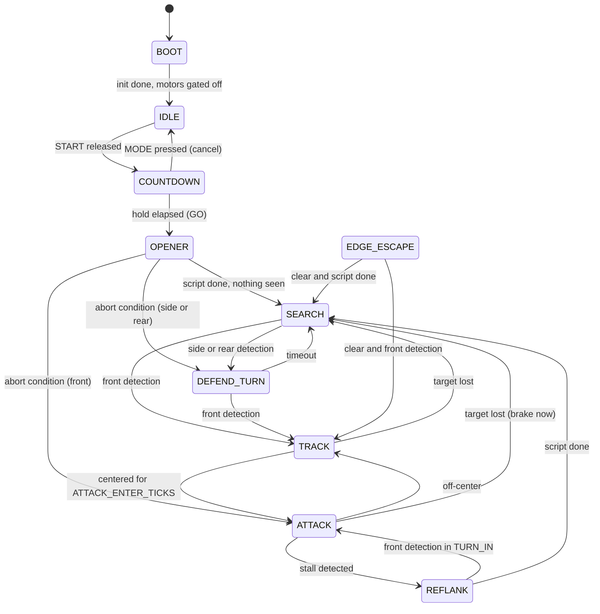

# BEHAVIOR.md

The behavior specification for src/core. Tests are written from this file (test-author), code implements it, and the judges see its tables. Section IDs (B0 to B16) are referenced by tests: keep them stable.

Change control: behavior changes need a DECISIONS.md entry and a human "yes". Numbers in B16 are defaults; the ring decides the final values (TUNING_LOG.md).

---

## B0. Conventions

- **Time:** `t_us` from micros(), passed in Inputs. Core code never reads a clock. Use unsigned subtraction for all intervals (micros wraps after about 71.6 minutes).
- **Tick:** 1 ms (TICK_US = 1000).
- **Duty:** per side, range -1.0 to +1.0, positive = forward. The governor (B6) produces the final value.
- **Heading:** degrees from IMU yaw integration, reset to 0 at GO, positive = clockwise (right).
- **Relative bearing:** 0 = straight ahead, positive = right, negative = left.
- **World bearing:** heading + relative bearing, wrapped to (-180, 180].
- **Mirroring:** every left/right behavior is defined once (right version) and mirrored by negating bearings and turn directions. A property test checks mirror symmetry.
- **line_mask bits** (1 = white): 0 FL, 1 FR, 2 RL, 3 RR.
- **opp_mask bits** (1 = detected, after polarity correction): 0 FL15, 1 FC, 2 FR15, 3 SL, 4 SR, 5 RL, 6 RR.

Inputs (per tick): t_us, line_mask, line_raw_us[4], opp_raw_mask, heading_deg, gyro_z_dps, ax_g, ay_g, imu_ok, vbat_v, button_level (from A1).
Outputs (per tick): duty_l, duty_r, motors_enabled, ui_state, recorder frame and events.

D-059 (selected under D-051,2026-09-23) clarifies heading reset as a **logical
match origin** established before same-tick GO motion. The caller's continuous
yaw is never reset at GO; Fusion/stuck/phantom histories stay in that raw domain.
Motion and match telemetry use raw yaw minus the captured origin. GO uses the
current healthy yaw, else the last actual healthy yaw, else nominal local0 with
a pending origin and imu_ok=false. With no history, the first healthy recovery
anchors that origin without moving captured references or extending deadlines.
Nominal/retained fallback coordinates never become measured world/inward evidence.
Healthy nonfinite yaw, an unrepresentable match difference or repeated GO without
reset latches an inhibited coordinate fault until reset; ordinary missing IMU
continues B14 fallback. Retained directional evidence is projected without age
refresh; continuous yaw is not wrapped. All measured evidence keeps its provenance.

---

## B1. States

| State | Motors | Purpose |
|---|---|---|
| BOOT | off | Init HAL, IMU, UI |
| IDLE | off | Mode selection, service menu, sensor view |
| COUNTDOWN | off (EN LOW) | 5-second hold plus margin; calibration |
| OPENER | on | Scripted opening routine for the selected mode |
| SEARCH | on | Deliberate hunt pattern |
| TRACK | on | Opponent in front but not centered: steer to center |
| ATTACK | on | Opponent centered: approach, contact, push |
| DEFEND_TURN | on | Opponent at side or rear: turn to face it |
| EDGE_ESCAPE | on | White line: get back inside |
| REFLANK | on | Break off a stalled push and hit the side |
| STOPPED | off | Both buttons held 1 s, or a fault needing a human |
| DRIVE_TEST | on | P3 only: SEARCH plus edge logic, no attack |

EDGE_ESCAPE preempts every moving state (B2). Both buttons held for BTN_LONG_MS enter STOPPED from any state.

---

## B2. Arbitration (every tick, in this order)

1. **Gated-state services, then gate (D-018, human-approved 2026-09-22).** Update button/countdown/gated-state services before checking the motor-output gate. State in {BOOT, IDLE, COUNTDOWN, STOPPED}: duties 0, motors disabled, return. This supersedes the original early gate return; unresolved service semantics remain tracked separately.
2. **Update perception:** opponent fusion (B5), edge classifier (B4), contact and stall detectors (B11), battery filter.
3. **Edge (D-020, human-approved 2026-09-22).** After the countdown gate, persistent white requires entering or remaining in EDGE_ESCAPE unless push-through eligible (B9.4); this includes white already present at GO and white still present when an escape script finishes. New white bits may re-plan per B4.4. All-four-white latches an inhibited fault per B4.2.
4. **Escape continues.** EDGE_ESCAPE active: run its script. Only a new edge event interrupts it (re-plan).
5. **Re-flank phases BACK and SWING continue.** Front detections are expected here and ignored (B11).
6. **Opener continues** unless its abort condition fired (B12).
7. **Front detection** (confirmed): TRACK, or ATTACK when centered.
8. **Side or rear detection:** DEFEND_TURN. Exception: ignore it while in ATTACK with a centered front target.
9. **Otherwise:** SEARCH.
10. **Governor** (B6) shapes the requested duties into outputs.

Invariant (locked test): after GO, a white reading on any QTR puts the robot in EDGE_ESCAPE within 1 tick, except inside the push-through window (B9.4).

D-060 (selected under D-051,2026-09-23) defines the production transaction in
state/analysis/P1_robot_contract.md. Raw line classification and Fusion run once
before gated services so they share one observation; services/STOP still precede
the motor gate. Edge/script/normal/stall arbitration precedes the one final contact
commitment and Governor pass. Required stale/invalid context or missing actual
application feedback latches inhibited STOPPED. Feedback must match the prior
request's direction/cap; timing or recorder incompleteness alone does not inhibit.
The contract also makes warning, history, frame and event boundaries explicit.

---

## B3. Countdown and start

- **IDLE:** a short MODE press cycles the mode (B13). A START press followed by release (debounced BTN_DEBOUNCE_MS) enters COUNTDOWN. Under D-019 (human-approved 2026-09-22), the complete countdown starts on the tick when release debounce completes, not at the earlier raw release sample.
- **START held at boot:** ignored until released and pressed again.
- **COUNTDOWN duration:** COUNTDOWN_MS + COUNTDOWN_MARGIN_MS (5000 + 100). MOTOR_EN stays LOW. The LED matrix shows 5, 4, 3, 2, 1.
- **Gyro bias calibration (D-024, human-approved 2026-09-22):** average finite IMU-valid gyro_z readings in [1.5 s, 4.5 s) into the hold. Spread is maximum minus minimum. Require at least two valid readings; any invalid reading in the window, too few readings, or spread above CAL_MAX_SPREAD_DPS rejects calibration, keeps the previous bias and sets a flag.
- **Line check (D-024):** latch a warning if any QTR reads white during the last 1 s (robot placed on a line). Do not block the start.
- **Opponent snapshot (D-024):** retain the latest confirmed opp_mask from the last 300 ms. Openers use it (B12).
- **GO:** at t_release + hold, where t_release is the completed-release-debounce timestamp under D-019. Heading resets to 0. MotorGate enables subject to higher safety inhibits, including D-020's all-white fault. The recorder logs START release, GO, and the first nonzero duty time (metric M1).
- **MODE press during COUNTDOWN:** cancel to IDLE (bench and practice use).

---

## B4. Edge detection and escape

### B4.1 Reading
- Parallel RC read of 4 QTRs every tick: drive all 4 lines HIGH for QTR_CHARGE_US, switch to input, time each discharge up to QTR_TIMEOUT_US.
- White if discharge time is below QTR_WHITE_US[i] (per sensor, calibrated in P2/P3 and with the QTR_CAL service mode on any ring).
- Edge event: a bit is white for QTR_CONFIRM_TICKS consecutive ticks (default 1).
- Brown start lines must read black (P3 test 3.6).

### B4.2 Escape table (right-side cases shown; left mirrors)

| White bits | Meaning | Script |
|---|---|---|
| FR | Front-right at edge | Brake 1 tick; reverse EDGE_BACK_MS at EDGE_BACK_DUTY; pivot left EDGE_TURN_DEG |
| FL + FR | Head-on to the edge | Brake; reverse EDGE_BACK_LONG_MS; pivot EDGE_TURN_FULL_DEG toward the side of the last seen opponent (default right) |
| RR | Rear-right at edge | Forward EDGE_FWD_MS with a left bias (inner wheel 70 %) |
| RL + RR | Rear at edge | Forward EDGE_FWD_MS straight |
| FR + RR | Right side along the edge | Pivot left 45 degrees; forward EDGE_FWD_MS |
| Diagonal (FL + RR or FR + RL) | Unusual angle | Treat as the front bit |
| 3 bits | Mostly outside | Drive toward the side whose sensors read black, at EDGE_BACK_DUTY, until 2 bits clear |
| 4 bits | No known black direction | D-020: remain in EDGE_ESCAPE, latch a fault, duties 0 and motors disabled until reset; do not guess a direction |

D-021 (human-approved 2026-09-22): forward escape segments request
EDGE_BACK_DUTY (0.80 default) as their base duty and use it as the final electrical
cap. Where the table calls for a bias, request 70% of base on the inner wheel.
All requests still pass through B6's compensation, per-side caps and slew; no
physical speed or final curvature is implied by the requested ratio.

D-044 (human-approved 2026-09-22): the head-on row brakes for one complete
TICK_US, then reverses for EDGE_BACK_LONG_MS at EDGE_BACK_DUTY before the
specified EDGE_TURN_FULL_DEG pivot. The interpretation of last-opponent-side
history remains a separate integration decision; this does not approve changing
an established locked test.

D-047 (human-approved 2026-09-22): head-on pivot side uses D-041's latest valid
nonzero selected relative-bearing sign; zero retains it and unknown defaults
right. D-048 (human-approved 2026-09-22) supersedes the three-white black-side
movement above: latch an escape fault, duties zero and motors disabled until
reset. The same inhibited recovery replaces movement after exhausted replans.

### B4.3 Being pushed out (edge defense)
Rear bit white while the opponent is centered in front and our duty is forward: we are losing a push. Do not keep pushing straight. Pivot 45 degrees away from the white side at TURN_DUTY, then forward EDGE_FWD_MS. This slides us out of the opponent's line.

D-049 (human-approved 2026-09-22): all-white/three-white faults come first.
Pushed-out qualification requires a current centered front and both previously
applied final wheel duties strictly positive. A single rear white side pivots
away; both rear sides pivot opposite D-047's shared opponent-side history,
default left. This maneuver precedes ordinary B4.2 row selection.

### B4.4 Rules
- Turns use IMU heading (B7). D-023 (human-approved 2026-09-22): configured durations remain unchanged across voltages; voltage compensation applies once to duty through B6.
- A new white bit on the side we are turning toward: re-plan. After EDGE_MAX_REPLANS re-plans, drive toward the black side as in the 3-bit row.
- Leaving EDGE_ESCAPE requires all 4 bits black and the script finished.
- After an escape, the final heading points inward. Store it as `inward_heading` for SEARCH (B8).

D-050 (human-approved 2026-09-22): during a pivot, a newly white bit on its
turning side requests replacement. During other active phases, any newly white
bit requests replacement; finished-but-white also requests replacement. Count
at most one replacement per fresh observation. Initial entry costs zero; allow
three replacement starts, then latch D-048's inhibited fault on the fourth
request. Preserve the budget until actual escape exit/reset. Fault masks take
priority over all row motion and replanning.

D-054 (selected under delegated D-051,2026-09-22): evaluate newly-white triggers
using the phase and captured intended pivot side at observation entry, even if
heading overshoot reverses the corrective duty. Then check DONE+white after
advancement; allow at most one replacement on that observation. Refresh the mask
baseline on clears and preserve it across replacements. Permission loss during
an active escape or invalid consumed motion context latches a reset-only inhibited
fault. Record a new inward heading only at actual all-black+DONE exit with current
healthy finite IMU yaw; unavailable/cached heading is not fresh inward evidence.

---

## B5. Opponent fusion

### B5.1 Debounce
- Polarity from OPP_ACTIVE_LOW_MASK (MZ80 bits active low, JS200XF bits active high).
- A bit turns on after OPP_SET_TICKS consecutive detected ticks and turns off after OPP_CLEAR_MS of consecutive clear ticks. This hysteresis kills single-sample flicker without adding more than 2 ms of delay on the rising edge.

### B5.2 Bearing table

| Active sensors | Relative bearing | Centered | Range cue |
|---|---|---|---|
| FC | 0 | yes | far or near |
| FL15 + FC | -6 | yes | |
| FC + FR15 | +6 | yes | |
| FL15 + FC + FR15 | 0 | yes | close (target fills the view) |
| FL15 + FR15 (no FC) | 0 | yes | close, straddling |
| FL15 | -15 | no | |
| FR15 | +15 | no | |
| SL | -90 | no | |
| SR | +90 | no | |
| RL | -135 | no | |
| RR | +135 | no | |

Priority when several groups are active: front, then side, then rear. SL and SR both active: keep the previous bearing and flag a conflict.

D-026 (human-approved 2026-09-22): both rear sensors use the same keep-previous/
conflict policy. With no previous detection there is no valid bearing to reuse.

### B5.3 Memory
Keep last_rel_bearing, last_world_bearing (heading + relative), last_seen_t, and last_front_side (which of FL15/FR15 lit most recently).

D-026: simultaneous first appearance of FL15 and FR15 retains the previous
last_front_side value, unknown if none exists. Do not invent a target/side at boot.

### B5.4 Contact cue
Contact if any of: FL15 + FC + FR15 all on for CONTACT_TICKS; IMU horizontal acceleration above IMPACT_G; FL15 + FR15 without FC for CONTACT_TICKS.

D-027 (human-approved 2026-09-22): horizontal impact magnitude is
sqrt(ax*ax + ay*ay), with IMU-valid data, strictly above IMPACT_G. Retain the
specified close-sensor timing. Contact latches only during centered ATTACK;
clear it on target loss, loss of centering or leaving ATTACK. Re-flank starts a
fresh latch; an old contact cannot authorize a later target.

### B5.5 Phantom mask (spectators outside the ring)
- If we TRACK or ATTACK a front-only target and an edge event happens within PHANTOM_WINDOW_MS with no contact cue, store that world bearing as a phantom.
- For PHANTOM_MS, front-only detections within PHANTOM_MASK_DEG of a phantom are ignored unless a side sensor or the close cue confirms them.
- Log PHANTOM_SET.

D-029/D-030 (human-approved 2026-09-22): begin the chase window at the first
front-only TRACK/ATTACK observation, retain it across TRACK/ATTACK, end it when
the chase ends and remember any contact cue. An edge within PHANTOM_WINDOW_MS
can mark the current world bearing only with no prior/current contact and valid
heading. Keep one marker: each newly qualified PHANTOM_SET replaces the previous
marker and restarts PHANTOM_MS.

### B5.6 Stuck sensor
A bit that stays on for OPP_STUCK_MS while the heading changes by more than 360 degrees is stuck: ignore it, show the fault icon, log it.

D-031 (human-approved 2026-09-22): use observed accumulated-heading span (maximum
minus minimum), strictly greater than 360 degrees, during continuous detection.
Invalid/unavailable IMU restarts qualification. Declared stuck bits remain ignored
until reset even if their input later clears.

---

## B6. Speed governor

Pipeline (D-017, human-approved 2026-09-22): requested duty per side, then voltage compensation, then state cap, then acceleration slew on final electrical duty, then clamp to [-1, 1]. Braking and safety-cap reductions are immediate. Full duty still requires centered contact. This supersedes the original cap/slew-before-compensation ordering; all B16 defaults remain unchanged.

| Situation | Cap |
|---|---|
| SEARCH, TRACK, DEFEND_TURN forward motion | SEARCH_DUTY_MAX |
| Pivot turns (sides opposite, little forward travel) | TURN_DUTY |
| OPENER | OPENER_DUTY_MAX |
| ATTACK before contact | ATTACK_APPROACH_DUTY |
| ATTACK after contact | ATTACK_DUTY (1.0) |
| EDGE_ESCAPE reverse | EDGE_BACK_DUTY |
| EDGE_ESCAPE forward (D-021) | EDGE_BACK_DUTY |
| REFLANK | REFLANK_BACK_DUTY or TURN_DUTY per phase |

- **Target loss in ATTACK:** the tick the front target clears (after debounce), brake both sides, then cap to SEARCH_DUTY_MAX. The recorder must show the drop within OPP_CLEAR_MS + 5 ms (P4 test 4.2).
- **Slew:** accelerating in the same direction, duty changes by at most SLEW_DUTY_PER_MS per ms. Braking to 0 is immediate. A direction reversal brakes first, then slews.
- **Voltage compensation:** duty_out = duty x V_NOM_V / max(vbat_filtered, VBAT_MIN_COMP_V), then clamp. vbat is filtered with a 1 s time constant. This keeps timed moves and speeds the same from a full to a tired pack.

---

## B7. Motion primitives

- **turnTo(target_heading, max_duty):** pivot in place. Duty = clamp(K_TURN_PER_DEG x error, TURN_MIN_DUTY, max_duty). Done when |error| < HEADING_TOL_DEG, or after TURN_TIMEOUT_MS (log a timeout).
- **arc(direction, inner_ratio, duty, sweep_deg or max_ms):** outer side at duty, inner side at duty x inner_ratio. Done at the heading sweep or timeout.
- **straight(duty, ms):** heading hold with a small P term so motor mismatch does not curve the path. D-022 (human-approved 2026-09-22): use K_TURN_PER_DEG, with correction magnitude limited to min(TURN_MIN_DUTY, abs(base duty)); correction cannot reverse a wheel. All requests still pass through the governor.
- **brake(ms):** both duties 0 with motors enabled.
- **IMU fault fallback:** when imu_ok is false, turns run for angle x TURN_MS_PER_DEG (measured in P3). D-023 (human-approved 2026-09-22): keep that timing and configured segment durations unchanged across voltages; compensate duty once through B6. Show the fault icon. This supersedes the ambiguous extra duration-compensation wording without changing B16 defaults.

---

## B8. Search (deliberate, never random)

1. Opponent seen within SEARCH_MEMORY_MS: turnTo(last_world_bearing) at TURN_DUTY, then scan in that direction.
2. Otherwise scan: rotate in place at SCAN_DUTY toward the last seen side (default right) until the heading has changed by 360 degrees.
3. Nothing found: advance straight for SEARCH_ADVANCE_MS at SEARCH_DUTY_MAX. Direction: `inward_heading` if an edge escape happened in the last 5 s, else the current heading.
4. Repeat 2 and 3, alternating the scan direction each cycle.

The pattern is deterministic and visibly purposeful (the tie-break criteria reward deliberate movement).

D-041 (human-approved 2026-09-22): last seen side is the sign of the latest valid
nonzero selected relative bearing. Zero retains the previous side; no known side
defaults right. SIDESTEP's explicit hint still controls its first scan.
D-042 (human-approved 2026-09-22): use directed yaw progress while IMU-valid.
On loss, latch one timed fallback for the last known remaining sweep clamped to
0..360 degrees, at TURN_MS_PER_DEG from that loss observation. Recovery cannot
restart it. Missing IMU at scan entry times the entire360-degree sweep; do not
inherit the short turn's700ms cutoff or count unavailable yaw as fresh evidence.

---

## B9. Track and attack

### B9.1 TRACK
- Base forward duty TRACK_DUTY. Differential = K_TRACK_PER_DEG x bearing (positive bearing: left wheel faster, turning right).
- For |bearing| of 15 degrees, add a pivot component so the robot turns faster than it drives.
- Enter ATTACK after ATTACK_ENTER_TICKS consecutive centered ticks.

### B9.2 ATTACK
- **Approach phase:** until the contact cue (B5.4), cap at ATTACK_APPROACH_DUTY.
- **Contact phase:** after the cue, ATTACK_DUTY with slew. Start the stall timer (B11). Log CONTACT.
- **Centering:** FL15 + FC steers slightly left; FC + FR15 slightly right. Small corrections only.

### B9.3 Exits
D-036 (human-approved 2026-09-22): left/right requests are base +/- correction,
bounded to [-1,1]. TRACK correction is K_TRACK_PER_DEG times bearing plus signed
TURN_MIN_DUTY for the +/-15-degree front-only rows; retain SEARCH_FORWARD governor.
ATTACK uses the approach/contact base and that gain limited to
min(TURN_MIN_DUTY,base), with the ATTACK governor. These quantify B9.1/B9.2 above.

- Front target lost: brake, SEARCH (turn toward the last bearing first).
- Off-center (FL15 only or FR15 only): TRACK.
- Stall: REFLANK.

### B9.4 Push-through window
If only front QTR bits are white, the opponent is centered, and FC is on, stay in ATTACK for up to EDGE_PUSH_THROUGH_MS, then escape. When FC clears (the opponent has gone over), escape at once. Default 0 ms (disabled). P4 test 4.4 may raise it, never above 100 ms.

---

## B10. Defend turn

D-061 (selected under D-051,2026-09-23) handles legitimate D-026 ambiguity at
Robot entry: without a valid bearing, remain at governed zero in DEFEND_TURN for
at most DEFEND_TIMEOUT_MS. Later valid capture does not extend that deadline;
current front/clear, edge and STOP still preempt. At expiry use the existing
SEARCH exit. See state/analysis/P1_ambiguous_defend_contract.md. This replaces
safe script-start inhibition for this one missing-bearing case, not validation
of malformed input or any motor safety rule.

- Trigger: side or rear detection with no front detection.
- Action: turnTo(heading + bearing) at TURN_DUTY. Any front detection aborts the turn into TRACK or ATTACK.
- Timeout DEFEND_TIMEOUT_MS: SEARCH.
- Option DEFEND_EVADE_FIRST (default 0): on a rear detection with an impact cue from behind, first arc forward and away for EVADE_MS, then turn. Enable only if P4 logs show we get rammed from behind.

---

## B11. Stall detection and re-flank

**Limitation, stated plainly:** the robot has no wheel encoders, and an IMU cannot measure a constant speed (acceleration is zero both when pushing steadily and when stuck). Stall detection is therefore an inference, validated with logs in P4.

### B11.1 Stall conditions (all must hold for STALL_MS)
- State ATTACK, contact phase.
- Opponent centered.
- Commanded duty at least STALL_MIN_DUTY.
- No edge event since contact.

Extra triggers:
- **Deflection:** heading changed more than STALL_DEFLECT_DEG since contact (the opponent's wedge is turning us).
- **IMU refinement (flag STALL_USE_IMU, default 0):** forward acceleration integrated from contact (assuming near-zero speed right after impact) shows less than STALL_MIN_DISP_M of travel. Enable only if P4 logs support it.

D-032 (human-approved 2026-09-22): STALL_MS continuous qualification OR earlier
deflection strictly above STALL_DEFLECT_DEG triggers stall. Both routes require
centered ATTACK contact, both forward final electrical duties at least
STALL_MIN_DUTY and no edge event since contact. Displacement refinement stays
disabled; D-025 ALL_IN suppresses the stall result without bypassing safety rules.

### B11.2 Re-flank script (right swing shown; left mirrors)
Side choice, first rule that applies:
1. If an edge escape happened in the last 5 s, swing away from the side where the edge was.
2. Else swing toward the side whose front sensor lit least recently (the opponent's more open side).
3. Else alternate from the previous re-flank.

Phases:
- **BACK:** reverse straight for REFLANK_BACK_MS at REFLANK_BACK_DUTY. Front detections ignored (expected).
- **SWING:** pivot REFLANK_PIVOT_DEG right, then arc with the opponent on the inner (left) side at REFLANK_ARC_RATIO for up to REFLANK_ARC_MS. SL or RL detection starts TURN_IN at once.
- **TURN_IN:** turnTo toward the detected bearing. A front detection enters ATTACK with a fresh contact timer.
- Edge events preempt every phase.

D-037 (human-approved 2026-09-22): the SWING arc uses TURN_DUTY as its outer
request and REFLANK_ARC_RATIO, bounded only by REFLANK_ARC_MS (no sweep cutoff).
When the earlier side-choice rules cannot choose, swing right first, then alternate.
D-038 (human-approved 2026-09-22): all re-flank exits use current-perception
arbitration. Current front selects TRACK and must satisfy ATTACK_ENTER_TICKS
centering before ATTACK; side/rear selects DEFEND_TURN; none selects SEARCH.
D-027's fresh contact requirement remains in force.

D-040 (human-approved 2026-09-22): natural arc completion without an inner
trigger exits through D-038. TURN_IN retains its captured turn until current
front detection, completion or timeout, then uses D-038. Edge and STOP preempt
every phase. D-043 (human-approved 2026-09-22): an unseen front side is less
recent than a seen side; both unseen/equal recency use the approved right-first
alternation. The higher-priority recent-edge side rule is unchanged.

### B11.3 Limits
- At most REFLANK_MAX_PER_10S re-flanks in any 10 s window. Beyond that: ALL_IN. D-025 (human-approved 2026-09-22) supersedes unconditional full duty: suppress stall checks for ALL_IN_MS only. Full duty still requires centered contact; target loss still brakes and edge handling retains priority. All B6 caps and the existing default-disabled push-through rule remain in force.
- If the opponent follows us during BACK (front detection plus contact cue), it is a charger: skip to SWING immediately.

---

## B12. Openers

Placement assumption: behind our start line, facing the ring center (the opponent). If the organizers allow any orientation, add a pre-angled SIDESTEP variant through a DECISIONS.md entry.

### O1. SIDESTEP_R (mode 1, default) and SIDESTEP_L (mode 2)
1. **PIVOT:** turnTo(+SS_PIVOT_DEG) at TURN_DUTY. Front detections ignored: the opponent is expected ahead.
2. **DRIVE:** straight for SS_DRIVE_MS at OPENER_DUTY_MAX with heading hold. The inner side is LEFT. SL or RL detection starts TURN_IN at once (the flank moment). A front detection means the opponent moved into our path: ATTACK.
3. **TURN_IN:** turnTo(heading - SS_TURNIN_DEG), turning left. A front detection enters ATTACK. Finished with no detection: SEARCH, scanning left first.
Side or rear detection on the outer side at any phase: DEFEND_TURN.

D-033 (human-approved 2026-09-22): in DRIVE/TURN_IN a current front target takes
priority over the outer-side/rear abort; otherwise that outer abort remains.
PIVOT still ignores front, so outer-side/rear detection there requests DEFEND_TURN.

### O2. DIRECT (mode 3)
- If the countdown snapshot or the current reading shows a front detection: enter ATTACK at once (approach, then contact).
- Else drive straight for DIRECT_MS at OPENER_DUTY_MAX. Front detection: ATTACK. Side or rear: DEFEND_TURN. Done: SEARCH.

### O3. ARC_R (mode 4) and ARC_L (mode 5)
1. **PIVOT:** turnTo(+ARC_PIVOT_DEG). Front detections ignored.
2. **ARC:** arc left (inner side LEFT) at ARC_DUTY with ARC_RATIO until the heading has swept ARC_SWEEP_DEG or ARC_MAX_MS passed. SL or RL detection: TURN_IN. Front detection: ATTACK.
3. **TURN_IN:** toward the detected bearing, then ATTACK; or SEARCH if nothing.

### O4. WAIT, matador (mode 6)
- Brake in place for up to WAIT_MAX_MS.
- **Approach cue:** FC on, then FL15 or FR15 also turns on within APPROACH_WINDOW_MS (the target is widening, so it is closing in). On the cue: run SIDESTEP_R phases 2 and 3 with no pivot, then ATTACK.
- Side or rear detection: DEFEND_TURN.
- WAIT_MAX_MS elapsed: SEARCH.

D-055 (selected under D-051,2026-09-22) supersedes the no-pivot instruction:
the ordered approach cue starts the complete existing SIDESTEP_R, including
its initial pivot. FC must remain confirmed continuously and a flank must newly
rise on a later fresh observation within inclusive APPROACH_WINDOW_MS. Initial
simultaneous FC+flank is not a cue; held FC does not refresh an expired window;
FC clearing rearms. Current side/rear abort takes priority over cue, then cue
over WAIT expiry. Existing SIDESTEP aborts and D-034 normal reacquisition remain.
This is a development policy; physical charger-evasion performance is unmeasured.

D-034 (human-approved 2026-09-22), all opener exits: the ATTACK/target wording
above denotes a request for normal current-perception arbitration. Current front
selects TRACK, with ATTACK requiring ATTACK_ENTER_TICKS consecutive centered
observations; current side/rear selects DEFEND_TURN; no current target selects
SEARCH. A countdown snapshot alone cannot authorize ATTACK. Immediate target-loss
braking, contact lifetime and edge priority remain in force.

---

## B13. Modes and UI

| Mode | Name | Matrix shows |
|---|---|---|
| 1 | SIDESTEP_R (default at boot, MODE_DEFAULT) | "1" and a right arrow |
| 2 | SIDESTEP_L | "2" and a left arrow |
| 3 | DIRECT | "3" and an up arrow |
| 4 | ARC_R | "4" and a right curve |
| 5 | ARC_L | "5" and a left curve |
| 6 | WAIT | "6" and a pause bar |

Service menu (long MODE press toggles it): SENSOR_VIEW (7 opponent bits + 4 line bits live), QTR_CAL (hold each QTR over white and black; stores thresholds in RAM and prints them for config.h), DRIVE_TEST (P3), LOG_DUMP.

Buttons: MODE short press (under 600 ms) = next item. MODE long press (BTN_LONG_MS) = service menu toggle. START press and release = start the countdown (match modes) or run the service action. Both held BTN_LONG_MS = STOPPED from any state.

D-057 (selected under D-051,2026-09-23): service START routing filters only a new
qualified release supplied to the match gate. Debounce, MODE cancellation, STOP
and existing countdown timers always continue. A suppressed release is consumed,
never replayed when match selection returns. The qualified input snapshot alone
cannot authorize a service action or motion; final IDLE/fault/STOP policy applies.
This selector cannot cancel an already accepted hold or revoke READY permission.

D-058 (selected under D-051,2026-09-23) defines logical MODE gestures. In IDLE,
qualify NONE then exclusive MODE for BTN_DEBOUNCE_MS; the actual MODE qualification
starts its duration. First observed NONE freezes that duration and wins a tied
long deadline. After NONE qualifies, a duration strictly below600ms advances the
item;600–999ms is a no-op. Continuously observed MODE reaching BTN_LONG_MS toggles
services once, with no release action. Boot-held MODE, interrupted releases,
START/BOTH/invalid input and leaving IDLE require a fresh qualified NONE before
another gesture. A countdown-canceling MODE cannot also change an IDLE selection.
Final STOP/fault inhibition overrides every menu action. Services enter at
SENSOR_VIEW, cycle in listed order and retain match mode on exit. Qualified
service START emits a typed intent only, and begins a fresh NONE arming interval;
DRIVE_TEST is unavailable in P1. Consumers remain separately implemented and
cannot grant a match start. Duplicate timestamps cannot replay menu events.

D-035 (human-approved 2026-09-22): logical BOTH first qualifies for
BTN_DEBOUNCE_MS, then the complete BTN_LONG_MS starts on that qualification tick.
Any observed release before expiry cancels the pending hold. STOPPED remains
inhibited until reset into the normal boot/start sequence. Electrical BOTH
decoding is still governed by the unresolved hardware decision SC-A.

Matrix bottom row: battery bar. Fault icons: IMU, stuck sensor, low battery, gyro calibration rejected.

---

## B14. Faults and degraded modes

| Fault | Detection | Response |
|---|---|---|
| IMU missing or silent | Init fails or no data for 20 ms | imu_ok = false; timed motion fallback (B7); icon; log |
| Opponent sensor stuck | B5.6 | Ignore that bit; icon; log |
| QTR reading white for over QTR_STUCK_MS with the robot pivoting in place | Timer | Keep obeying it (safety over performance); icon; log |
| Low battery | vbat under VBAT_WARN_V in IDLE | Icon; no behavior change during a match |
| Tick overrun | Tick over 1000 us | Count and log max; flag if more than 1 % of ticks in a match |
| Watchdog reset | Reset cause at boot | Boot to IDLE with motors off; log the cause if available |

---

## B15. Flight recorder

- **Frames** at LOG_HZ (25, D-072): t_ms, state, mode, line_mask, opp_mask, heading (0.01 degree), gyro_z (0.1 dps), ax and ay (mg), duty_l and duty_r (int8, scale 127), vbat (0.01 V), flags (imu_ok, phantom active, stuck, calibration rejected), tick_max_us. About 24 bytes per frame.
- **Events** at their exact tick: START_RELEASE, GO, FIRST_NONZERO_DUTY, every state change, EDGE (with mask), CONTACT, STALL, REFLANK phase changes, PHANTOM_SET, faults. 8 bytes each, ring of 4096.
- **Capacity:** at least 200 s of frames. If RAM is short, drop to 25 Hz. D-028 (human-approved 2026-09-22) supersedes the impossible unlimited "Never drop events" requirement: retain the first4096 events. On further events latch overflow, increment a saturating rejected-event counter, continue frame recording and clearly mark the dump as incomplete evidence. Overflow does not change motion; never silently overwrite retained events.
- **Dump:** only in IDLE (service mode LOG_DUMP or a request from Linux). CSV lines go over Bridge/Monitor to Linux; tools/dump_match.sh stores `logs/<date>_<time>_<mode>_frames.csv` and `_events.csv`. Never during a match (rule R2).

---

D-072 (2026-09-23, selected under D-051) adopts the existing25Hz fallback. The
original50Hz owner image failed the installed RAM size check (356608B/262144B);
the isolated25Hz image passed at226584B. See state/analysis/P2_memory_compile_validation.md.
This changes logging cadence only: keep200s of frames,4096exact-tick events and
the1kHz control loop. Actual loading/free RAM, full HAL growth,200s/no-gap dump
and worst-case timing remain unverified; no phase or hardware gate follows.

## B16. Tunables (src/config.h)

Defaults are starting points. "Tuned in" names the phase that sets the final value from evidence.

| Constant | Default | Unit | Tuned in |
|---|---|---|---|
| COUNTDOWN_MS | 5000 | ms | locked |
| COUNTDOWN_MARGIN_MS | 100 | ms | organizer answer Q5 |
| TICK_US | 1000 | us | locked |
| QTR_CHARGE_US | 10 | us | P2 |
| QTR_TIMEOUT_US | 1500 | us | P2 |
| QTR_WHITE_US[4] | 300 each | us | P2, P3 |
| QTR_CONFIRM_TICKS | 1 | ticks | P3 |
| QTR_STUCK_MS | 1500 | ms | P3 |
| OPP_ACTIVE_LOW_MASK | 0x78 | bits | P2 |
| OPP_SET_TICKS | 2 | ticks | P2 |
| OPP_CLEAR_MS | 30 | ms | P4 |
| OPP_STUCK_MS | 5000 | ms | P4 |
| CAL_MAX_SPREAD_DPS | 2.0 | dps | P2 |
| SEARCH_DUTY_MAX | 0.30 | duty | P3 (stopping table) |
| SCAN_DUTY | 0.45 | duty | P3 |
| TURN_DUTY | 0.80 | duty | P3 |
| TURN_MIN_DUTY | 0.25 | duty | P3 |
| K_TURN_PER_DEG | 0.02 | duty/deg | P3 |
| HEADING_TOL_DEG | 5 | deg | P3 |
| TURN_TIMEOUT_MS | 700 | ms | P3 |
| TURN_MS_PER_DEG | 2.0 | ms/deg | P3 (fallback) |
| SEARCH_MEMORY_MS | 3000 | ms | P4 |
| SEARCH_ADVANCE_MS | 300 | ms | P3 |
| TRACK_DUTY | 0.45 | duty | P4 |
| K_TRACK_PER_DEG | 0.02 | duty/deg | P4 |
| ATTACK_ENTER_TICKS | 3 | ticks | P4 |
| ATTACK_APPROACH_DUTY | 0.60 | duty | P4 (lost-target test) |
| ATTACK_DUTY | 1.00 | duty | P4 |
| CONTACT_TICKS | 20 | ticks | P4 |
| IMPACT_G | 1.5 | g | P4 |
| SLEW_DUTY_PER_MS | 0.02 | duty/ms | P3 |
| V_NOM_V | 11.1 | V | P2 |
| VBAT_MIN_COMP_V | 9.0 | V | P2 |
| VBAT_WARN_V | 10.8 | V | P2 |
| EDGE_BACK_DUTY | 0.80 | duty | P3 |
| EDGE_BACK_MS | 120 | ms | P3 |
| EDGE_BACK_LONG_MS | 180 | ms | P3 |
| EDGE_TURN_DEG | 120 | deg | P3 |
| EDGE_TURN_FULL_DEG | 160 | deg | P3 |
| EDGE_FWD_MS | 200 | ms | P3 |
| EDGE_MAX_REPLANS | 3 | count | P3 |
| EDGE_PUSH_THROUGH_MS | 0 | ms | P4 (max 100) |
| PHANTOM_WINDOW_MS | 1500 | ms | P4 |
| PHANTOM_MS | 3000 | ms | P4 |
| PHANTOM_MASK_DEG | 25 | deg | P4 |
| STALL_MS | 1000 | ms | P4 |
| STALL_MIN_DUTY | 0.80 | duty | P4 |
| STALL_DEFLECT_DEG | 25 | deg | P4 |
| STALL_USE_IMU | 0 | flag | P4 |
| STALL_MIN_DISP_M | 0.10 | m | P4 |
| REFLANK_BACK_MS | 150 | ms | P4 |
| REFLANK_BACK_DUTY | 0.80 | duty | P4 |
| REFLANK_PIVOT_DEG | 60 | deg | P4 |
| REFLANK_ARC_MS | 400 | ms | P4 |
| REFLANK_ARC_RATIO | 0.40 | ratio | P4 |
| REFLANK_MAX_PER_10S | 2 | count | P4 |
| ALL_IN_MS | 1500 | ms | P4 |
| DEFEND_TIMEOUT_MS | 800 | ms | P4 |
| DEFEND_EVADE_FIRST | 0 | flag | P4 |
| EVADE_MS | 200 | ms | P4 |
| OPENER_DUTY_MAX | 0.85 | duty | P5 |
| SS_PIVOT_DEG | 50 | deg | P5 |
| SS_DRIVE_MS | 250 | ms | P5 |
| SS_TURNIN_DEG | 110 | deg | P5 |
| DIRECT_MS | 400 | ms | P5 |
| ARC_PIVOT_DEG | 80 | deg | P5 |
| ARC_RATIO | 0.45 | ratio | P5 |
| ARC_DUTY | 0.70 | duty | P5 |
| ARC_SWEEP_DEG | 200 | deg | P5 |
| ARC_MAX_MS | 1500 | ms | P5 |
| WAIT_MAX_MS | 2000 | ms | P5 (never above 2000) |
| APPROACH_WINDOW_MS | 300 | ms | P5 |
| LOG_HZ | 25 | Hz | P2; D-072 low-memory fallback |
| BTN_DEBOUNCE_MS | 20 | ms | P2 |
| BTN_LONG_MS | 1000 | ms | P2 |
| MODE_DEFAULT | 1 | mode | locked |
